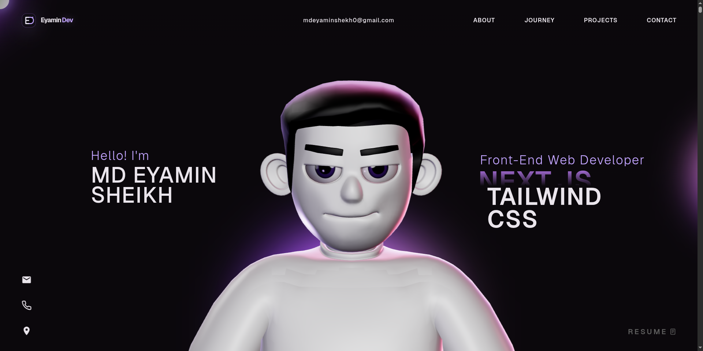
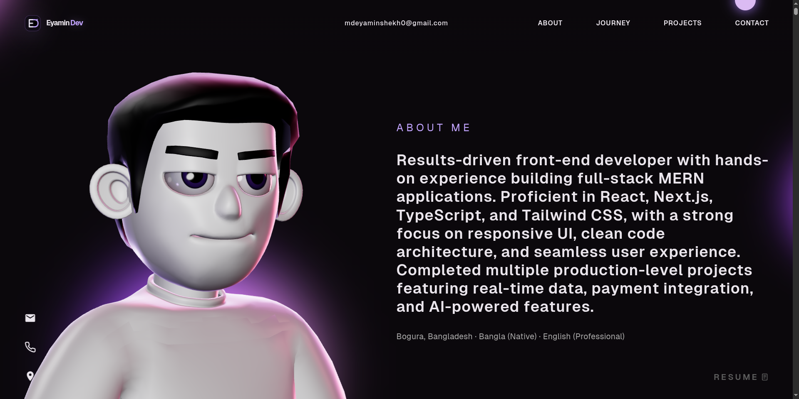
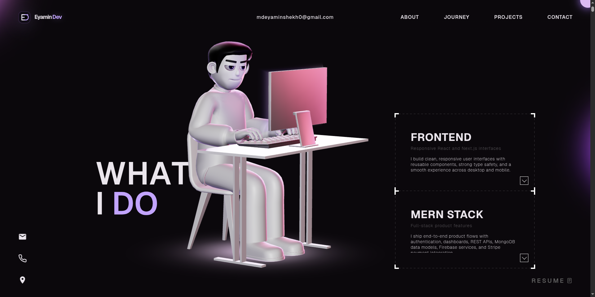

# EyaminDev Portfolio — Full Project Technical Documentation

A modern **React + TypeScript + Vite** personal portfolio website featuring:

* Cinematic intro loading experience
* Fully animated 3D character
* Scroll-driven storytelling
* Interactive tech stack physics scene
* Responsive premium UI
* GSAP motion system
* Three.js real-time rendering

**Live Site:** https://precious-kashata-3bcd4b.netlify.app/

---

# 📌 Project Overview

This portfolio is designed to showcase a Full Stack Developer in a premium and memorable way.

Instead of using a normal static portfolio, this project combines:

* Traditional frontend UI
* Advanced animation systems
* Real-time 3D rendering
* Scroll choreography
* Physics interactions
* Clean architecture

---

# 🖼 Screenshots

## Hero Section



## About Me Section



## What I Do Section



---

# ⚙️ Core Technologies Used

## Frontend Stack

* React 18
* TypeScript
* Vite

## Animation Stack

* GSAP
* ScrollTrigger
* @gsap/react

## 3D Stack

* Three.js
* three-stdlib
* GLTFLoader
* DRACOLoader
* HDR Environment Maps

## Secondary 3D Scene

* @react-three/fiber
* @react-three/drei
* @react-three/rapier

## UI Tools

* react-icons
* react-fast-marquee

---

# 🏗 Project Architecture

```text
src/
 ├── main.tsx
 ├── App.tsx
 ├── context/
 ├── components/
 ├── data/
 └── assets/
```

---

# 🚀 Application Flow

## Step 1 — Entry Point

## `src/main.tsx`

Responsible for mounting React application.

```tsx
ReactDOM.createRoot(...).render(<App />)
```

---

## Step 2 — Main App Shell

## `src/App.tsx`

Loads:

* Loading Provider
* MainContainer
* Character Scene
* Lazy loaded components

This keeps startup optimized.

---

## Step 3 — Loading Experience

## `src/context/LoadingProvider.tsx`

Controls loading state.

Flow:

```text
Loading Screen → Assets Ready → Intro Animation → Main Site
```

---

# 🎨 UI Structure

## `src/components/MainContainer.tsx`

Builds all sections:

* Navbar
* Hero Section
* About
* Services
* Career Journey
* Projects
* Tech Stack
* Contact
* Social Icons

---

# 📁 Content Management

## `src/data/portfolioData.ts`

Stores all editable content:

* Name
* Skills
* Services
* Experience
* Projects
* Contact data

This allows future updates without editing UI files.

---

# 🎬 Animation System

# GSAP Used In This Project

GSAP powers nearly all premium motions.

Used for:

* Intro reveal
* Scroll scenes
* Text transitions
* Character transitions
* Section fades
* Camera movement

---

# Intro Animation

## File:

`src/components/utils/initialFX.ts`

Used after loading completes.

Effects:

* Navbar fade in
* Hero text rise up
* Social icons reveal
* Character entrance

Example:

```ts
gsap.from(".hero", {
  y: 60,
  opacity: 0,
  duration: 1.4,
  ease: "power3.out"
})
```

---

# Scroll Animation System

## File:

`src/components/utils/GsapScroll.ts`

This is the heart of cinematic storytelling.

Uses:

```ts
gsap.timeline({
  scrollTrigger: {
    trigger: ".section",
    scrub: true
  }
})
```

---

# Scroll Timeline Breakdown

# Timeline 1 — Hero Exit

When user scrolls:

* Character rotates
* Camera shifts
* Hero text fades
* Layout transitions

---

# Timeline 2 — Services Reveal

Actions:

* Camera zooms out
* Character tilts
* Monitor light turns on
* Service cards reveal

---

# Timeline 3 — Character Lift

Character smoothly moves upward.

Uses:

```ts
ease: "none"
```

Meaning:

Linear movement with no acceleration.

---

# 🤖 Main 3D Character System

# File:

`src/components/Character/Scene.tsx`

Unlike common portfolios, this project does **not** use React Three Fiber for main avatar.

Instead:

```text
Raw Three.js renderer
Manual camera control
Manual render loop
Custom optimized lifecycle
```

Benefits:

* Better performance control
* Cleaner animation mixer control
* Precise camera choreography

---

# Character Loading Process

## File:

`character.ts`

Flow:

```text
Encrypted Model (.enc)
→ Decrypt
→ Blob URL
→ GLTFLoader
→ DRACOLoader
→ GPU Compile
→ Scene Ready
```

---

# Security Layer

## File:

`decrypt.ts`

Uses AES-CBC decryption for protected model file.

Purpose:

* Prevent direct model theft
* Hide source asset

---

# 🎞 Character Animation System

## File:

`animationUtils.ts`

Uses:

```ts
THREE.AnimationMixer
```

Animations loaded from GLTF clips.

---

# Active Clips

## Intro Clip

* Plays once
* Holds final pose

```ts
LoopOnce
clampWhenFinished = true
```

---

## Idle Support Clips

Continuously running:

* key1
* key2
* key5
* key6

These add subtle life movement.

---

## Typing Animation

Filtered to only selected bones:

* Arms
* Hands
* Legs

This prevents full-body distortion.

---

## Brow Animation

Triggered on hover.

Used for realistic facial reaction.

---

# 🎯 Mouse Controlled Head Tracking

## File:

`mouseUtils.ts`

Head follows cursor.

Logic:

```ts
targetX = mouseX * Math.PI / 6
head.rotation.y = lerp(current, targetX, 0.08)
```

---

# Why It Feels Realistic

Because movement uses:

```ts
THREE.MathUtils.lerp()
```

Meaning:

Smooth interpolation frame-by-frame.

Instead of snapping instantly.

---

# Touch Devices

On mobile:

* Return speed slower
* More natural feel

---

# 💡 Lighting System

## File:

`lighting.ts`

Lights used:

* Directional Light
* Rim Light
* Point Light
* HDR Environment

---

# Smart Monitor Glow Effect

Inside model there is hidden mesh:

```text
screenlight
```

Its emissive intensity controls real scene light.

Meaning:

When monitor glows, room glows too.

Very premium detail.

---

# 🧲 Tech Stack Physics Scene

## File:

`TechStack.tsx`

Built separately using:

* React Three Fiber
* Rapier Physics

Features:

* Floating skill icons
* Mouse interaction
* Sphere collisions
* Dynamic movement

Feels alive and modern.

---

# 📂 Important Files Explained

| File                | Responsibility      |
| ------------------- | ------------------- |
| main.tsx            | React entry point   |
| App.tsx             | App shell           |
| LoadingProvider.tsx | Loading state       |
| MainContainer.tsx   | Main page sections  |
| portfolioData.ts    | All content         |
| Scene.tsx           | Main 3D world       |
| character.ts        | Load character      |
| decrypt.ts          | Secure model        |
| animationUtils.ts   | Character clips     |
| mouseUtils.ts       | Head tracking       |
| lighting.ts         | Lights              |
| GsapScroll.ts       | Scroll choreography |
| TechStack.tsx       | Physics scene       |

---

# 🎨 Why This Portfolio Feels Premium

Because it combines:

* Motion design
* Storytelling scroll
* Real-time graphics
* Smart transitions
* Human-like character reactions
* Clean responsive layout

---

# 🔥 Professional Level Achievements In This Project

✔ Advanced Frontend Engineering
✔ Real-time 3D Integration
✔ Animation Architecture
✔ GPU Asset Optimization
✔ UX Storytelling
✔ Premium Branding

---

# 🚀 Future Improvements

Recommended next upgrades:

* Dark / Light theme switcher
* CMS dashboard
* Blog system
* Multilingual support
* SEO optimization
* Analytics
* AI chatbot assistant
* Contact automation

---

# 👨‍💻 Author

**EyaminDev**
Full Stack Web Developer

---

# Final Summary

This is not a normal portfolio.

It is a combination of:

```text
Portfolio + Brand Identity + Motion Experience + 3D Showcase
```

Which makes it stand out strongly in hiring, freelancing, and personal branding.

---
